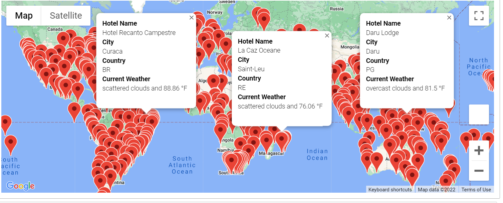
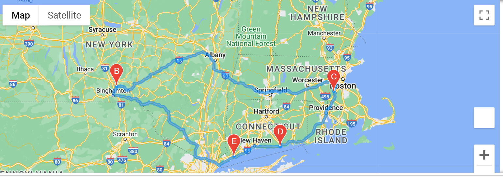

# World Weather Analysis
## Overview

This project aims to create an application that simulates travelers choosing their destination based on temperature preferences. Hotel options are presented and an itinerary is displayed on Google Maps. This app was developed on Jupyter Notebook, using Google Maps and Open Weather Map APIs.

## Results

Destinations were defined by randomly generating latitudes and longitudes. Based on the coordinates, a series of requests were made to the Open Weather Map API. Data retrieved was saved in a CSV file and includes city, country, maximum temperature, and current weather description. 

Next, a call was made to Google places API to locate hotels in each city listed on the CSV file that matched the user preference criteria. Results were plotted on a map, as seen in the image below.

Finally, an itinerary connecting the chosen cities was created using directions API.

## Summary

The application is divided into three parts:
- Weather Data: In this folder, there is the code that generated the coordinates and the Open Weather requests, as well as the CSV file with the data retrieved from the API. 
- Vacation Search: In this folder, there is a code where the user can set their preferred temperature range, a list of cities that meet that criteria, and a Google maps with hotels in their preferred cities.
- Vacation Itinerary: In this folder, there is the code that calls Google Maps Directions API to create the itinerary as well as the locations of hotels in the chosen cities. The results are also saved as png files.
